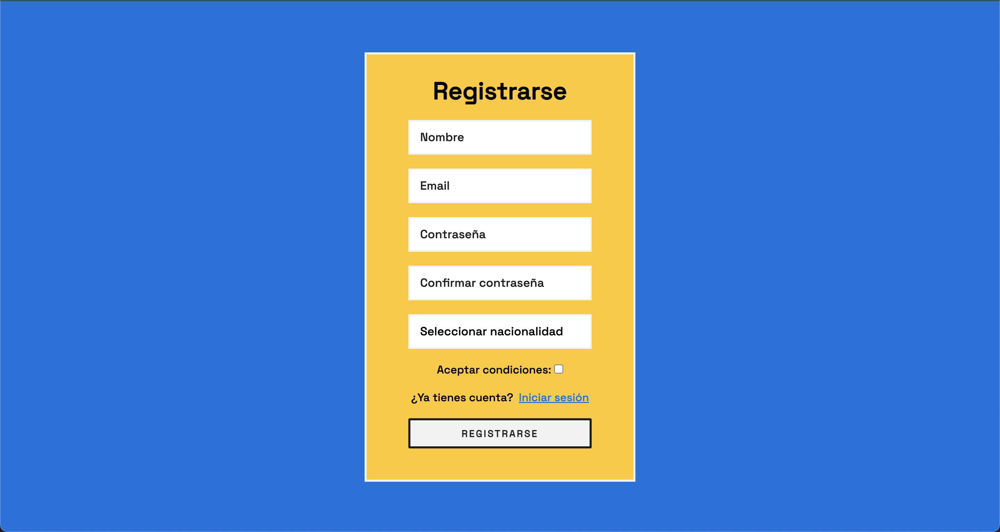
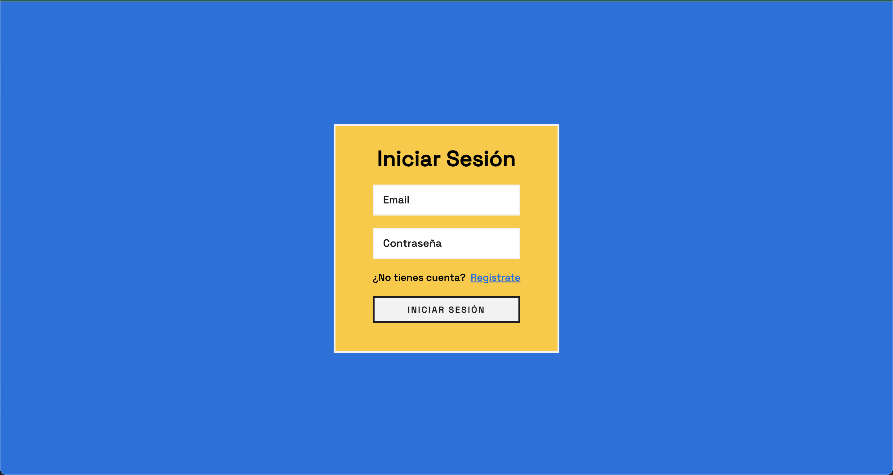
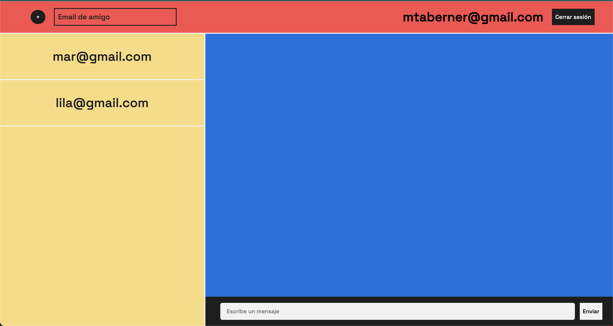
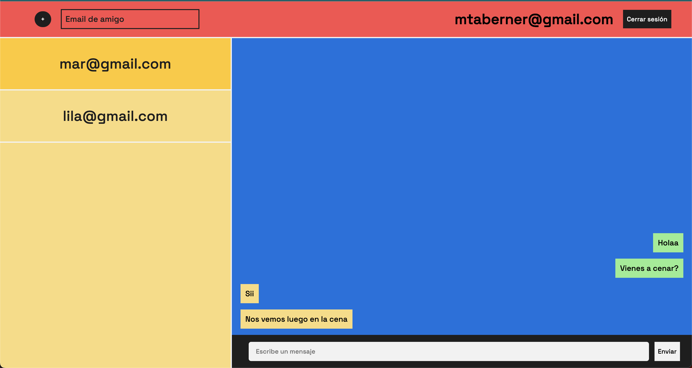

# ChatWeb

Esta es una página web diseñada para permitir a los usuarios chatear con sus amigos. Los usuarios pueden registrarse e iniciar sesión en la aplicación para acceder a todas las funciones. Una vez dentro, podrán añadir amigos y comenzar conversaciones con ellos. Los amigos deben estar previamente registrados en la base de datos del sistema.

## Características principales

-   **Registro:** Los usuarios pueden registrarse.
-   **Inicio de sesión:** Los usuarios pueden iniciar sesión en la aplicación.
-   **Añadir amigo:** Los usuarios pueden añadir amigos a su lista de contactos para iniciar una conversación.
-   **Iniciar conversación:** Los usuarios pueden clickar en un amigo para iniciar la conversación.

## Estructura de carpetas

El proyecto está organizado en las siguientes carpetas:

- `XatLLM`
  - `src/main/java`: Archivos del backend desarrollados en Java

- `ChatWeb_Frontend`: Archivos del frontend desarrollados en HTML, CSS y JavaScript.
  - `resources`:
    - `css`: Archivos css usados para el estilo
    - `javascript`: Archivos JavaScript usados para la interacción
    -  `img`: Imágenes de ejemplo de la aplicación

## Tecnologías utilizadas

- Backend: Se ha desarrollado utilizando Java.

- Base de datos: Se ha creado una base de datos en MySQL.

- Frontend: El frontend de la aplicación se ha desarrollado utilizando HTML, CSS y JavaScript.

## Requisitos previos

Antes de ejecutar la aplicación, asegúrate de tener instalados los siguientes requisitos previos:

-   [Tomcat](https://tomcat.apache.org/download-90.cgi): Un servidor web Java para ejecutar aplicaciones web.

-   [MySQL](https://dev.mysql.com/downloads/connector/j/): Un sistema de gestión de bases de datos relacional.

## Instalación

1.  Clona este repositorio.
2.  Asegúrate de tener Tomcat instalado y configurado correctamente en tu entorno de desarrollo.
3.  Configura la base de datos MySQL ejecutando el script DDL que encontrarás en el repositorio con el nombre `xat_DDL.sql`.
4.  Inicia el servidor backend ejecutando el servidor Tomcat.
5.  Para acceder a la aplicación abre en tu navegador el archivo `registro.html` ubicado en la carpeta `ChatWeb_Frontend`.

## Imágenes de ejemplo

- **Registro de usuarios**

- **Inicio de sesión**

- **Página principal**

- **Conversación**

